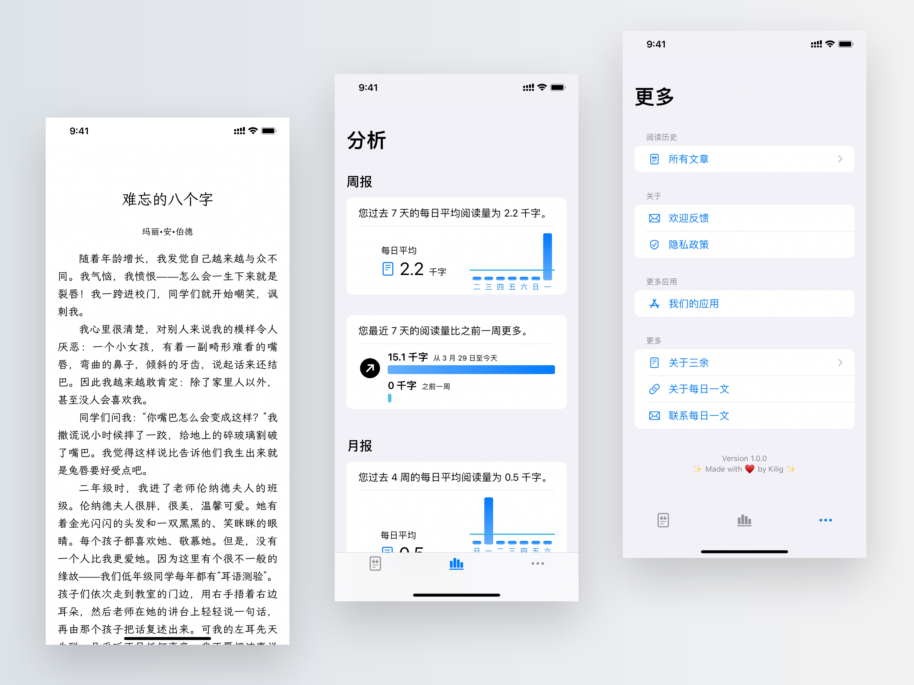

# 三余

    

## Description

[每日一文](http://meiriyiwen.com) 非官方客户端。

『冬者岁之余，夜者日之余，阴雨者时之余也。』是谓三余。

> 每天花 10 分钟阅读一篇文章，一个月可以有大约 50000 字的阅读量，一年有近 60 万字的阅读量，专注、执着，每天阅读。
> 
> 只为简单的纯净的阅读而生。
> 
> 简单生活，每日一文。

## ScreenShot

## MIT License

Copyright (c) 2022 KiligWYu

Permission is hereby granted, free of charge, to any person obtaining a copy
of this software and associated documentation files (the "Software"), to deal
in the Software without restriction, including without limitation the rights
to use, copy, modify, merge, publish, distribute, sublicense, and/or sell
copies of the Software, and to permit persons to whom the Software is
furnished to do so, subject to the following conditions:

The above copyright notice and this permission notice shall be included in all
copies or substantial portions of the Software.

THE SOFTWARE IS PROVIDED "AS IS", WITHOUT WARRANTY OF ANY KIND, EXPRESS OR
IMPLIED, INCLUDING BUT NOT LIMITED TO THE WARRANTIES OF MERCHANTABILITY,
FITNESS FOR A PARTICULAR PURPOSE AND NONINFRINGEMENT. IN NO EVENT SHALL THE
AUTHORS OR COPYRIGHT HOLDERS BE LIABLE FOR ANY CLAIM, DAMAGES OR OTHER
LIABILITY, WHETHER IN AN ACTION OF CONTRACT, TORT OR OTHERWISE, ARISING FROM,
OUT OF OR IN CONNECTION WITH THE SOFTWARE OR THE USE OR OTHER DEALINGS IN THE
SOFTWARE.